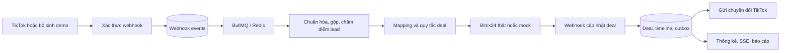
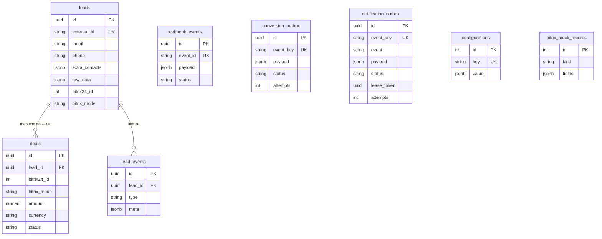

# Mô tả hệ thống

[Về README](../README.md) · [Hướng dẫn](GUIDE.md) · [Kết quả](RESULTS.md)

## Luồng xử lý

Webhook được lưu trước xử lý nền. HTTP 202 xác nhận tiếp nhận; email/SĐT sai có thể chỉ thất bại ở worker. Bộ phục hồi đưa sự kiện đã lưu nhưng chưa xử lý vào queue. Trùng `event_id` không tạo lại tác vụ nghiệp vụ.

Lead được chuẩn hóa email/SĐT và gộp theo liên hệ, giữ liên hệ chính, lưu liên hệ bổ sung vào `extra_contacts`. Campaign/form/ttclid chính giữ theo lần đầu. Tương tác và hoàn tất form được ghi timeline, cộng điểm tương ứng 5/10, tối đa 100.

Scoring ban đầu: phone 30 + email 20 + city 10 + số câu trả lời × 10 (phần câu trả lời tối đa 40). Khi gộp, score giữ giá trị lớn hơn giữa lead cũ và payload mới, chưa tính lại từ toàn bộ trường sau merge. Sự kiện tương tác không khớp `ttclid` của lead hiện có không cộng điểm; luồng tương tác hiện không xếp lại job đồng bộ/xét rule tự động.

Đồng bộ CRM dùng khóa theo lead và tra `ORIGIN_ID` trước khi tạo. Rule mặc định tạo deal khi có liên hệ và điểm lead từ 70; từ 85 ưu tiên cao; mapping và rules có thể đổi qua API. Giá trị trong DB được ưu tiên hơn mặc định trong source.

Webhook Bitrix giữ khóa đồng bộ theo lead, đọc CRM trước khi mở transaction ghi dữ liệu, rồi ghi deal/timeline/conversion outbox/notification outbox cùng transaction. Tạo deal mới cũng ghi notification outbox cùng transaction. Bộ gửi thông báo dùng lease 60 giây, không giữ transaction trong lúc gọi HTTP; gửi tối đa 5 lần khi gặp lỗi, bên nhận chống trùng bằng `Idempotency-Key`/`event_id`. Thiếu URL thông báo chỉ ghi trạng thái demo `logged`. Conversion mock thành công dùng `mocked`, API thật thành công dùng `sent`.

## Các phần trong source

| Thư mục                   | Trách nhiệm                                                |
| ------------------------- | ---------------------------------------------------------- |
| `src/tiktok`              | Webhook, chữ ký, dữ liệu demo, chuyển đổi outbox           |
| `src/leads`               | Chuẩn hóa/gộp, nhập dữ liệu, worker xử lý lead             |
| `src/bitrix24`            | REST client, worker đồng bộ, callback, mock CRM, phân công |
| `src/deals`               | Lưu deal, rule engine, ước lượng ngân sách demo            |
| `src/analytics`           | SQL thống kê, SSE, xuất và gửi báo cáo                     |
| `src/auth`                | Phiên quản trị Redis                                       |
| `src/config`              | Mapping/rules/costs và kiểm tra production                 |
| `src/queues`              | Phục hồi queue và dead-letter                              |
| `src/database`            | Entity, sáu migration hiện tại, seed                       |
| `src/docs`                | CSS/HTML và logic trình duyệt cho Swagger                  |
| `src/integration`, `test` | Kiểm thử có PostgreSQL/Redis thật và cấu hình Jest         |
| `src/tools`               | Gửi demo, xuất Swagger, cấu hình VND                       |

## Dữ liệu

Sơ đồ rút gọn các trường chính. Một lead có tối đa một deal cho mỗi `bitrix_mode`; ID số CRM duy nhất theo cặp mode/ID. Dữ liệu liên kết cũ mang mode `legacy`, được đối chiếu nguồn gốc khi nối lại. Redis lưu queue, cache cấu hình 60 giây và phiên; PostgreSQL giữ dữ liệu nghiệp vụ và lịch sử.

## Quyết định và đánh đổi

| Lựa chọn                              | Lý do và giới hạn                                                                       |
| ------------------------------------- | --------------------------------------------------------------------------------------- |
| Inbox PostgreSQL + BullMQ             | Phản hồi nhanh, phục hồi được sau lỗi queue; kết quả nghiệp vụ có độ trễ                |
| Khóa PostgreSQL và unique key         | Giảm xử lý trùng khi chạy đồng thời; lời gọi CRM vẫn nằm ngoài transaction DB           |
| Outbox cùng transaction cập nhật deal | Tránh deal/outbox lệch khi rollback; HTTP có thể gửi lặp, cần mã chống trùng bên nhận   |
| Mock CRM trong cùng app               | Dễ chạy demo và lưu ID qua restart; không chứng minh hành vi portal thật                |
| SSE dùng chung truy vấn theo khoảng   | Thăm dò mỗi giây, tối đa 32 khoảng hoạt động mỗi tiến trình; chưa phải cơ chế pub/sub   |
| Xuất báo cáo bằng con trỏ PostgreSQL  | CSV/JSON gửi theo luồng và tốc độ bên tải, XLSX dùng tệp tạm; ngắt tải sẽ hủy nguồn đọc |
| API key + phiên Redis                 | Đơn giản cho demo/quản trị; chưa có RBAC theo người dùng                                |

Thống kê đếm lead/deal/won theo campaign và ngày tạo lead. CPL = chi phí/số lead; ROI = (doanh thu won − chi phí)/chi phí, trả null nếu chi phí bằng 0. Chi phí nhập thủ công bằng VND cho đúng nhóm lead và khoảng báo cáo; không tự phân bổ theo ngày. Nếu có deal won bằng ngoại tệ khác VND, doanh thu và ROI trả null, `revenue_valid=false`; không cộng các đơn vị tiền khác nhau.

## Giới hạn cần theo dõi

- API danh sách lead/deal hiển thị dữ liệu theo filter cung cấp, không tự lọc mode như analytics. Phân biệt số bản ghi trong một trang (`items`) với tổng (`total`).

- Analytics/export chỉ lấy mode CRM hiện tại (`BITRIX24_MOCK`). Lead được tính nếu thuộc mode đó hoặc có deal liên kết trong mode đó; deal `legacy` chưa xác định mode không được tự gộp vào báo cáo. Payload demo đưa vào CRM thật vẫn thuộc báo cáo real.
- Worker thử lại HTTP 408/429/5xx và lỗi DB theo backoff; HTTP 429 có `Retry-After` sẽ hạn chế nhận job tiếp theo cho đủ thời gian. Giới hạn mặc định 3 job đồng bộ/giây; một job có thể gọi nhiều REST method. Chỉ NotFoundException được phân loại lead không tồn tại; các HTTP 4xx khác không thử lại.
- Notification và conversion gửi theo cơ chế ít nhất một lần; bên nhận phải xử lý idempotency. Lease thông báo hết hạn sẽ được nhận lại sau khi tiến trình bị ngắt.
- Mapping tùy chỉnh và stage/pipeline phải khớp portal. Stage thắng/thua hiện dựa trên tên mã chứa hậu tố WON hoặc LOSE/LOST.
- Cần nghiệm thu TikTok thật, kiểm thử tải SSE/queue và phân quyền trước production. Không suy ra khả năng chạy nhiều instance an toàn tuyệt đối từ các test hiện có.